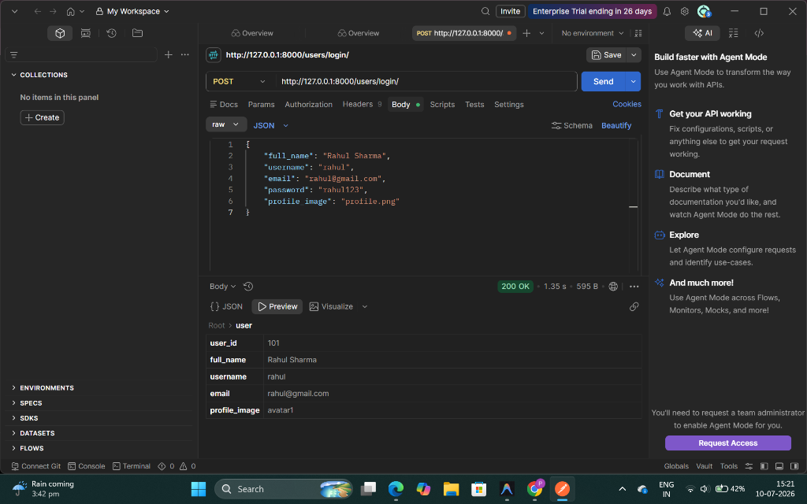
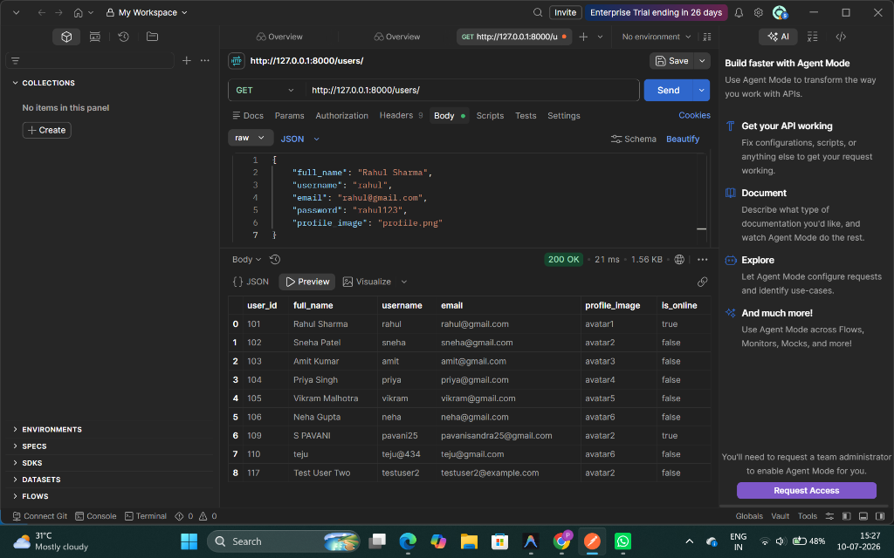
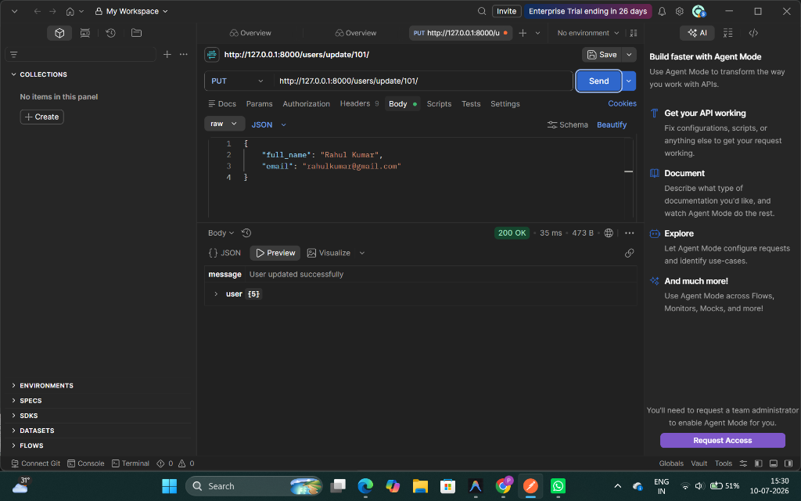
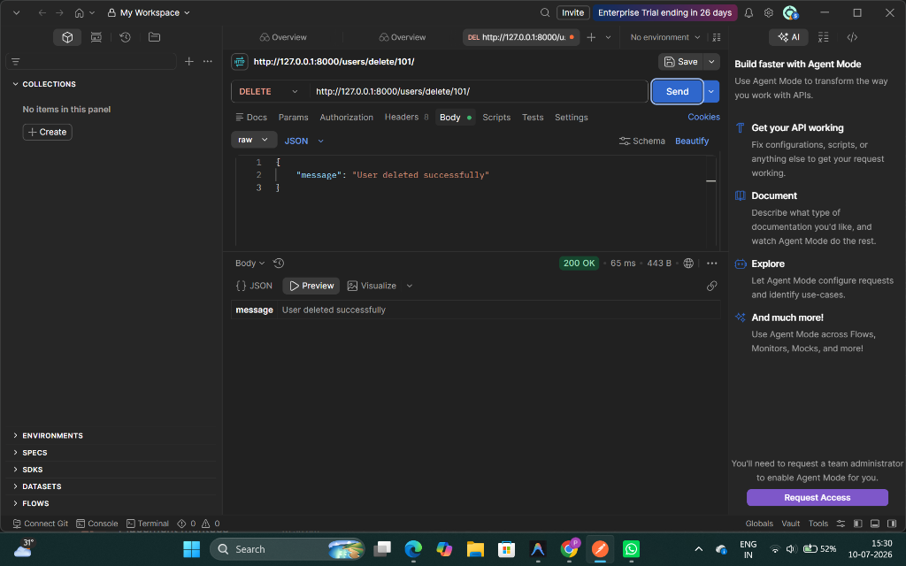
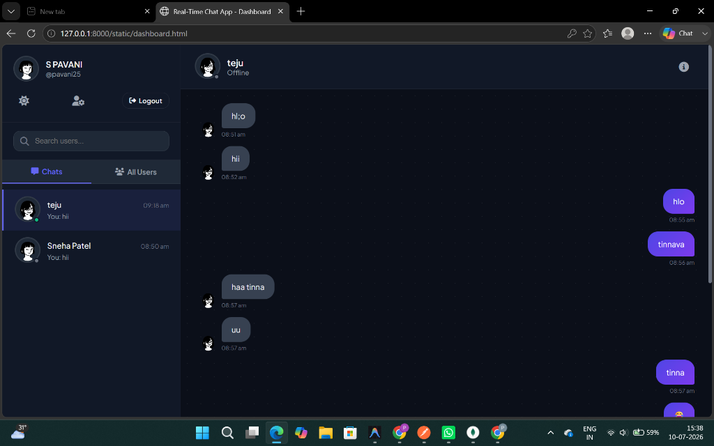
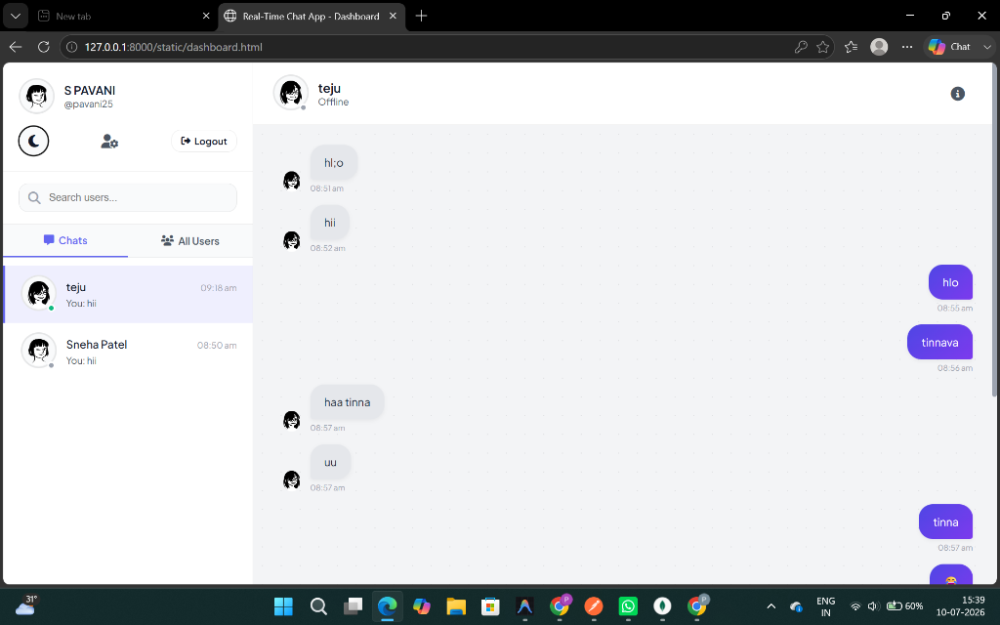
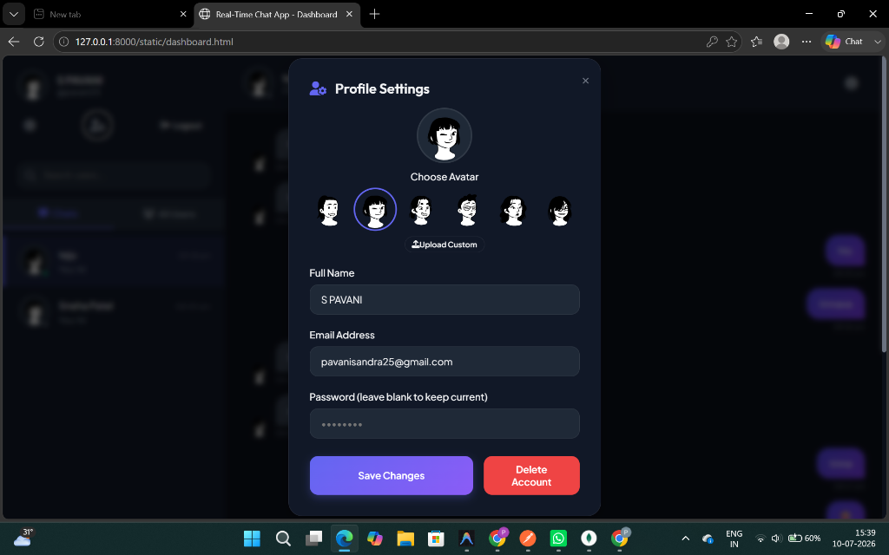
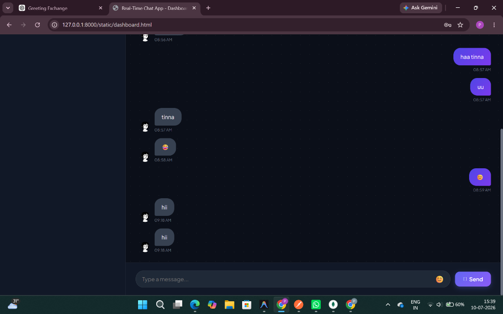
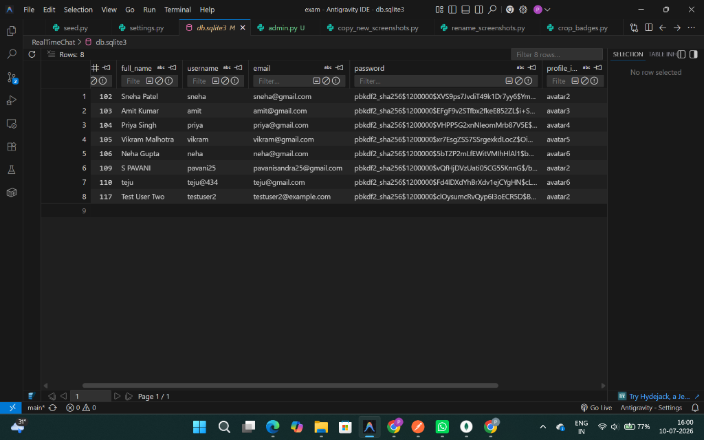
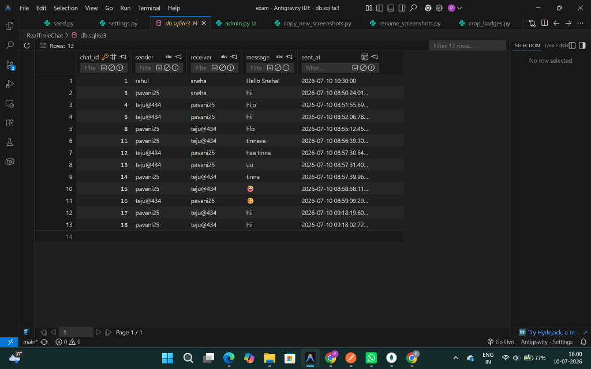

# Real-Time Chat Application

A premium, responsive, and secure **Real-Time Chat Application** built as a web system. The application features a restful Django backend service, a modern HTML5/CSS3/JavaScript frontend client, and a local SQLite database with complete CRUD operations and interactive real-time-like features.

---

## 🚀 Features

### Core Modules
1. **Module 1 - User Management**
   - User Registration (including preset avatars or custom image uploads with Base64 encoding).
   - Basic Session/Header Authentication (Login, Logout, and session validation).
   - View all registered users.
   - Profile Settings: Full CRUD support allowing users to edit their profile details or permanently delete their account.
2. **Module 2 - Chat Management**
   - Instantly send text messages to other registered users.
   - Edit sent messages inline (Update).
   - Delete sent messages (Delete).
   - Clean message bubbles (sent vs. received alignment, hover action controls, and status timestamps).
3. **Module 3 - Conversation Management**
   - Summarized list of active threads (Recent Chats) showing the contact, their status, last message preview, and time.
   - Detail view of historical messages exchanged with a specific user.

### Bonus Features (20 Marks)
1. **Online/Offline User Status (4 Marks)**: Checks `last_active` timestamps dynamically (users active within the last 10 seconds display a green "Online" badge, else a grey "Offline" badge).
2. **Search Users (4 Marks)**: Interactive search bar in the sidebar to search for users by name or username.
3. **Auto Refresh Chat (4 Marks)**: Client polls API endpoints every 3 seconds to fetch new messages and update online statuses dynamically.
4. **Dark/Light Theme (4 Marks)**: Global dark/light theme toggler that persists preferences in `localStorage` across welcome, register, login, and dashboard pages.
5. **Emoji Support, Typing Indicators & Custom Avatars (4 Marks)**:
   - Preset selector with 6 premium avatars + custom image uploader.
   - Built-in emoji picker dropdown to insert emoticons.
   - Active typing indicator ("*Sneha Patel is typing...*") that appears when the other party is entering message text.

---

## 🛠️ Technology Stack
* **Frontend**: HTML5, Vanilla CSS3 (custom styling system with HSL colors & glassmorphism), JavaScript (ES6, DOM manipulation, and Fetch API).
* **Backend**: Django (Function-Based Views, REST JSON responses, custom middleware, CORS headers, security hashing).
* **Database**: SQLite (ORM integration with Django models).

---

## 📁 Expected Folder Structure

```
RealTimeChat/
│
├── Backend/
│     ├── migrations/
│     ├── __init__.py
│     ├── asgi.py
│     ├── db.py          # Database Schema Models (UserProfile, ChatMessage)
│     ├── models.py      # Exposed models for Django Migrations
│     ├── settings.py    # Django CORS, App registration, Sessions settings
│     ├── urls.py        # API router mappings
│     ├── views.py       # REST Function-Based Views & Session controllers
│     └── wsgi.py
│
├── Frontend/
│     ├── index.html     # Welcome Landing page
│     ├── login.html     # Login page
│     ├── register.html  # Registration page
│     ├── dashboard.html # Interactive chat dashboard
│     ├── style.css      # Premium stylesheet (Light/Dark themes, responsive grids)
│     └── script.js      # Fetch API services, polling, typing status, message CRUD
│
├── screenshots/         # Verified application screenshots folder
│     ├── postman_login_user.png
│     ├── postman_get_users.png
│     ├── postman_update_user.png
│     ├── postman_delete_user.png
│     ├── frontend_dashboard.png
│     ├── frontend_dashboard_dark.png
│     ├── frontend_dashboard_light.png
│     ├── frontend_profile_settings.png
│     ├── frontend_chat_emojis.png
│     ├── database_userprofile.png
│     └── database_chatmessage.png
│
├── db.sqlite3           # Local SQLite Database
├── manage.py            # Django execution script
├── seed.py              # Populates database with sample test data
└── test_apis.py         # Automated program validation suite
```

---

## 🏁 Setup & Installation Instructions

### 1. Prerequisite Checks
Ensure you have **Python 3.10+** installed. Check your version with:
```bash
python --version
```

### 2. Prepare Database Schema
From the root `RealTimeChat/` folder, run migrations to generate and apply schemas:
```bash
python manage.py makemigrations Backend
python manage.py migrate
```

### 3. Pre-populate Sample Data (Seeding)
Seed the SQLite database with user-provided sample test profiles ("rahul" and "sneha") and their mock conversations:
```bash
python seed.py
```

### 4. Start the Django Server
Launch the REST backend on port `8000`:
```bash
python manage.py runserver 8000
```
The server runs locally at `http://127.0.0.1:8000/`.

### 5. Launch the Frontend
Simply open `RealTimeChat/Frontend/index.html` directly in any web browser. 

*Note: Since the backend is configured with full CORS permissions and supports static files, you can access the application directly through the Django development server at:*
👉 **[http://127.0.0.1:8000/static/index.html](http://127.0.0.1:8000/static/index.html)**

---

## 📡 API Documentation

### 1. User Management APIs

| Method | Endpoint | Payload / Fields | Description |
| :--- | :--- | :--- | :--- |
| **POST** | `/users/register/` | `full_name`, `username`, `email`, `password`, `profile_image` | Registers a new user account. |
| **POST** | `/users/login/` | `username`, `password` | Logs in and starts a user session. |
| **POST** | `/users/logout/` | *None* | Logs out the user and clears the session. |
| **GET** | `/users/me/` | *None* | Retrieves current logged-in user profile. |
| **GET** | `/users/` | `?search=query` (optional) | Retrieves all users (supports optional search). |
| **PUT** | `/users/update/<id>/` | `full_name`, `email`, `password`, `profile_image` (optional fields) | Updates user profile details. |
| **DELETE** | `/users/delete/<id>/` | *None* | Permanently deletes a user's account. |

### 2. Chat Management APIs

| Method | Endpoint | Payload / Fields | Description |
| :--- | :--- | :--- | :--- |
| **POST** | `/chats/send/` | `receiver`, `message` | Sends a message to the target username. |
| **GET** | `/chats/` | *None* | View all messages in the database. |
| **PUT** | `/chats/update/<id>/` | `message` | Edits an existing message (author only). |
| **DELETE** | `/chats/delete/<id>/` | *None* | Deletes a specific message (author only). |
| **POST** | `/chats/typing/` | `receiver`, `is_typing` | Sends active typing status flag. |

### 3. Conversation Management APIs

| Method | Endpoint | Description |
| :--- | :--- | :--- |
| **GET** | `/conversation/` | Retrieves all users whom the current user has chatted with, including the latest message preview. |
| **GET** | `/conversation/<username>/` | Retrieves the chronological conversation history with a user, plus their live typing status. |

---

## 📸 Application Screenshots & Verification

### 1. User Authentication Verification (Postman)
Below is the verification of the user creation/session login API (`POST /users/login/` or `/users/register/`). The response confirms that a user profile is created/logged-in, returning the unique `user_id`, personal metadata, and default avatar configuration:



---

### 2. Viewing Registered Users (Postman)
Verification of the `GET /users/` API endpoint returning all registered records from the database in JSON format. It lists user details including full name, username, email, active avatar key, and whether they are active (`is_online` status):



---

### 3. Updating User Profile details (Postman)
Verification of the profile update CRUD API (`PUT /users/update/<id>/`). A PUT request updating user `101`'s email to `rahulkumar@gmail.com` and full name to `Rahul Kumar` returns a successful completion code `200 OK`:



---

### 4. Deleting User Profile (Postman)
Verification of the user deletion API (`DELETE /users/delete/<id>/`). A DELETE request on user `101` removes their profile from the database and returns a confirmation JSON response:



---

### 5. Frontend Application Dashboard - Dark Mode
A view of the web chat application dashboard loaded in the browser under the default **Dark Theme**. It shows the sidebar showing the active thread listing and status indicators, paired with the scrollable chat history message bubbles using the custom cute avatars:



---

### 6. Frontend Application Dashboard - Light Mode
Demonstration of the **Dark/Light Theme toggler** (Bonus Feature 4). Clicking the theme toggle switches the CSS class attributes, dynamically applying an off-white background with dark elements for optimal readability:



---

### 7. User Profile settings Modal
Verification of the interactive user **Profile Settings Overlay Modal** (Bonus Feature 5). The modal allows users to dynamically update their Full Name, Email Address, select from the custom cute preset avatars, or upload their own custom avatar. It also includes the red button to delete the account:



---

### 8. Frontend Chat with Emojis & Message Input
Demonstration of **Emoji Support** (Bonus Feature 5) in the chat window, displaying shared emojis in the message list alongside the text entry textbox and the Send button:



---

### 9. Database Tables (SQLite Local Database View)
Direct table data views from the local SQLite database `db.sqlite3` verifying structural models and active records:

* **UserProfile Table (`Backend_userprofile`):**
  Shows user records, email configurations, and profile pictures:
  
  

* **ChatMessage Table (`Backend_chatmessage`):**
  Shows real-time chat histories, sender/receiver matching, and timestamps:
  
  

---

## 🧪 Automated API Testing
An automated test suite `test_apis.py` is included to programmatically verify all endpoints.
To execute tests, ensure the server is running and launch:
```bash
python test_apis.py
```
**Successful Verification Output:**
```
Starting API Integration Tests...
Test 1: User Registration... Status: 201. Registered User 1, User 2.
Test 2: User Login... Status: 200. Logged in successfully.
Test 3: View All Users... Status: 200. Passed.
Test 4: Search Users... Status: 200. Passed.
Test 5: Send Messages... Status: 201. Chat ID: 2.
Test 6: View All Messages... Status: 200. Passed.
Test 7: Conversation Summary List... Status: 200. Passed.
Test 8: Conversation History Detail... Status: 200. Passed.
Test 9: Update Message... Status: 200. Passed.
Test 10: Update User Profile... Status: 200. Passed.
Test 11: Delete Message... Status: 200. Passed.
Test 12: Delete User... Status: 200. Passed.
ALL REST API INTEGRATION TESTS PASSED SUCCESSFULLY!
```
